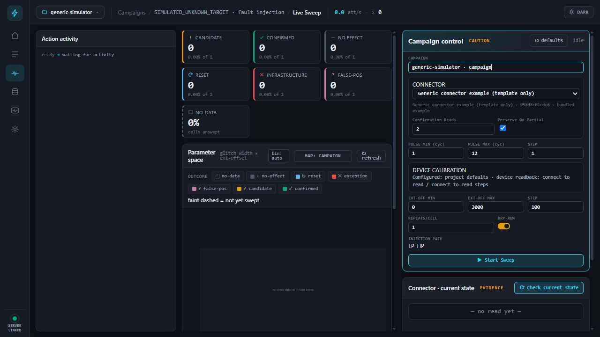
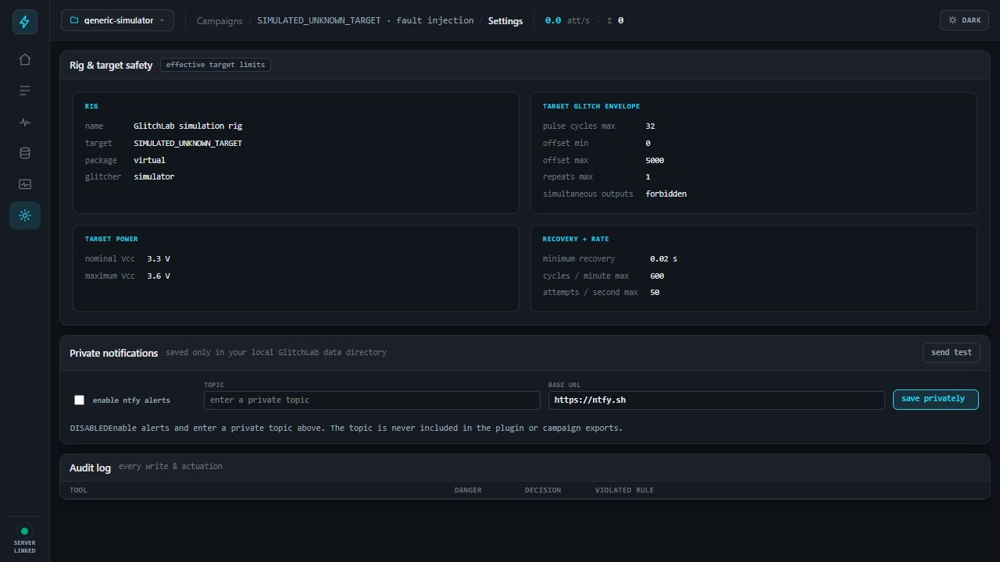

# GlitchLab

GlitchLab is a Codex plugin for authorized hardware fault-injection research. One marketplace install provides a standalone local MCP server, a browser dashboard, a simulator, hardware adapters, evidence storage, analysis tools, and a skill for building target connectors.

The MCP server is the product. The dashboard is browser-only; there is no desktop application in the public release.





## Install in Codex

1. Open **Settings → Plugins → Add plugin marketplace**.
2. Set **Source** to `Kevin4562/glitchlabs`, **Git ref** to `main`, and leave **Sparse paths** empty.
3. Add the marketplace, then install **GlitchLab**.
4. Start a new Codex window if the newly registered MCP tools are not visible yet.
5. Ask Codex: `Open GlitchLab.`

That is the entire user setup. On first start, the plugin resolves its locked Python environment, creates private configuration in the operating system's application-data directory, starts its MCP server, and binds the web UI to an OS-selected free port on `127.0.0.1`. The GlitchLab skill opens that URL in a new in-app browser tab.

## What it does

- Runs simulator and hardware-backed fault-injection campaigns without silently falling back from hardware to simulation.
- Enforces both rig-wide and target-specific safety envelopes before live actuation.
- Hot-loads private target connectors and fingerprints their source for reproducibility.
- Separates candidates, confirmed effects, clean misses, resets, false positives, and infrastructure failures.
- Persists raw attempts and evidence, produces parameter maps and statistics, and suggests refinement regions.
- Preserves unresolved target states and stops on confirmation or infrastructure failure according to policy.
- Exposes the same campaign state to Codex and the browser dashboard.

## Starting with an unknown target

GlitchLab materially shortens the path from an empty project to an evidence-backed result: the bundled skill walks Codex through target characterization, connector creation, conservative limit selection, baseline collection, timing discovery, coarse exploration, refinement, confirmation, and reproduction.

It cannot guarantee a successful glitch on every unknown target. Physical access, target behavior, measurement quality, injection hardware, trigger stability, and the correctness of the target connector remain decisive. The included connector is deliberately a non-functional generic template; it contains no real target protocol, memory map, unlock sequence, or known-good glitch parameters.

For a new target, ask Codex:

```text
Use $glitchlab to create a connector and safe discovery plan for this target.
```

The skill will use `get_connector_sdk_instructions`, create the connector in the private GlitchLab data directory, define explicit target limits and confirmation checks, validate it in simulation, and require a dry-run and preflight before any live epoch.

## Safety model

Use GlitchLab only on hardware you own or are authorized to test.

- Missing limits fail closed.
- Target limits may narrow rig limits but never widen them.
- Live adapters never fall back to the simulator.
- Timeouts and partial reads never become confirmed effects.
- Confirmation requires every connector-defined persisted check.
- Each live plan is sealed before execution; source or schema drift blocks the run.
- Destructive recovery, flashing, power control, and arbitrary instrument commands are separately classified and audited.
- Notification settings are disabled by default and stored only in private local settings. A configured topic is masked in status responses and excluded from campaign exports.

See [the connector and safeguard guide](plugins/glitchlab/skills/glitchlab/references/connector-and-safeguards.md) for the target onboarding contract.

## MCP tools

The standalone server registers 77 tools.

### Runtime

`get_glitchlab_status`

### Campaign data and analysis

`list_campaigns`, `query_attempts`, `get_parameter_map`, `analyze_clusters`, `get_statistics`, `bootstrap_confidence`, `predict_parameters`, `get_known_good`, `get_raw_capture`, `run_query`, `describe_schema`

### Connectors

`list_connectors`, `get_connector_schema`, `validate_connector_parameters`, `get_connector_sdk_instructions`

### Workflow state and recipes

`get_workflow_state`, `get_attempt_evidence`, `get_project_reproduction_recipe`, `get_reproduction_recipe`, `get_glitch_workflow`

### Data-plane writes

`record_attempt`, `open_campaign`, `open_session`, `define_sweep`, `annotate`, `reclassify`, `save_known_good`

### Projects

`create_project`, `list_projects`, `set_active_project`, `move_campaign`

### Campaign and target control

`control_sweep`, `preflight_check`, `inspect_preserved_target_state`, `discover_timing`, `run_handoff`, `acknowledge_target`, `discard_preserved_target_state`, `set_next_parameters`, `trigger_recovery`, `flash_target`, `move_stage`

### Native scope control

`describe_instrument`, `scope_discover`, `scope_bind`, `scope_unbind`, `scope_measure`, `scope_capture`, `scope_configure_acquisition`, `scope_screenshot`, `scope_channel_configure`, `scope_source_configure`, `scope_source_output`

### Bundled Rigol scope tools

`rigol_idn`, `rigol_get_scope_state`, `rigol_measure`, `rigol_measure_between`, `rigol_get_waveform`, `rigol_set_channel`, `rigol_set_timebase`, `rigol_set_trigger`, `rigol_set_cursors`, `rigol_get_cursor_values`, `rigol_run`, `rigol_stop`, `rigol_single`, `rigol_autoscale`, `rigol_screenshot`, `rigol_send_raw`

### Visible UI control

`ui_navigate`, `ui_click`, `ui_set_field`, `ui_fill_form`, `ui_highlight`, `ui_toast`, `ui_get_state`

## Public release boundary

Only the marketplace metadata and `plugins/glitchlab` are part of the release. The repository intentionally excludes local rig configuration, target profiles, private connectors, firmware, captures, databases, logs, debug output, test artifacts, and unreviewed images. The public history starts from a clean release commit so removed private material cannot be recovered from earlier Git history.

The bundled `generic-example` connector is a schema and lifecycle example only. Real connectors belong in the private application-data connector directory and are never copied into the plugin.

See [PUBLIC_RELEASE_REVIEW.md](PUBLIC_RELEASE_REVIEW.md) for the release audit and limitations.

## Repository layout

```text
.agents/plugins/marketplace.json       Codex marketplace (GlitchLab only)
plugins/glitchlab/
  .codex-plugin/plugin.json            plugin manifest
  .mcp.json                            standalone MCP process definition
  assets/                              reviewed branding and screenshots
  skills/glitchlab/                    operating and connector-building skill
  server/                              locked Python MCP server and browser UI
```

## Development

The end-user install performs dependency setup automatically. Contributors can run the same locked environment directly:

```powershell
cd plugins/glitchlab/server
uv run --locked --python 3.13 glitchlab-mcp
```

Run the release tests with:

```powershell
uv run --locked --extra test --python 3.13 pytest
```

## License

GlitchLab is released under the [MIT License](LICENSE). The bundled Rigol helper retains its own MIT notice at `plugins/glitchlab/server/vendor/rigol-mcp/LICENSE`.
